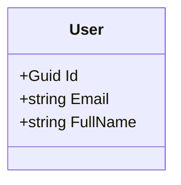
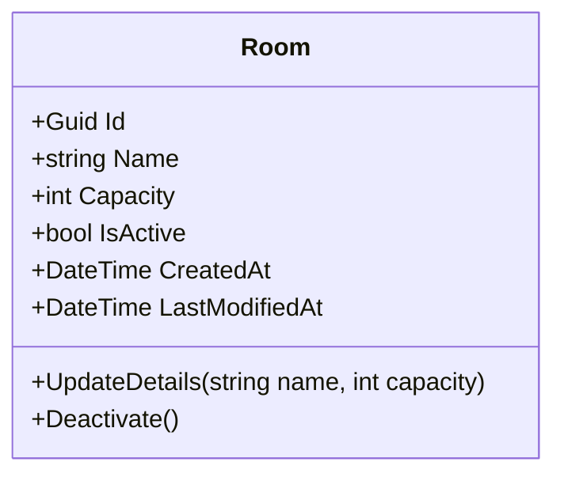
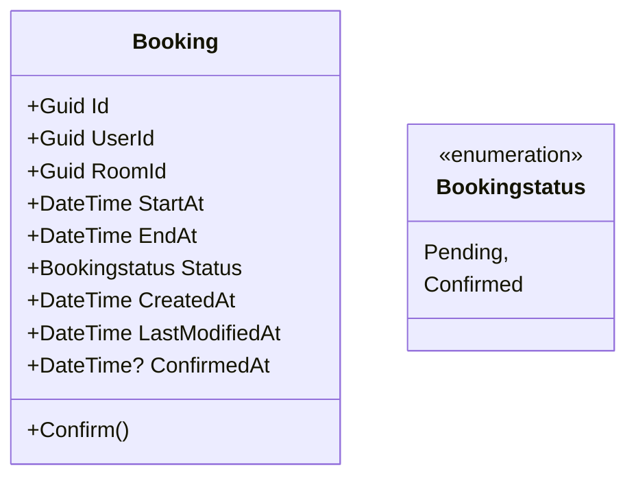
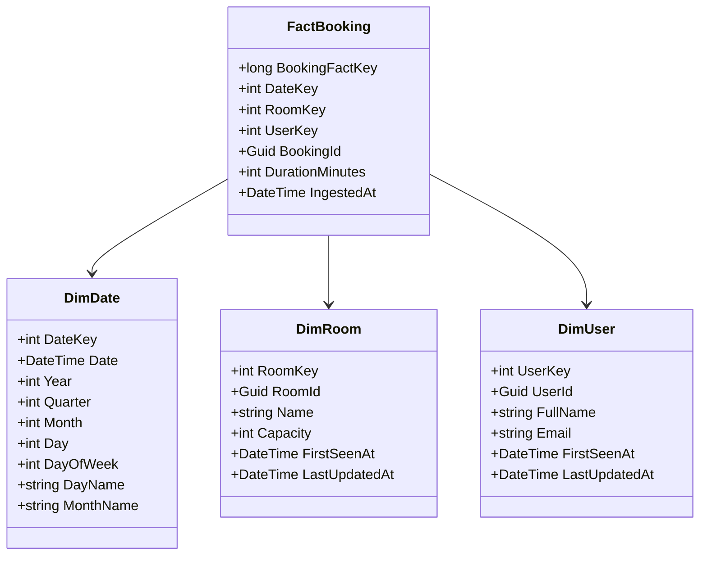

# Domain Model

## Users

```mermaid
classDiagram

class User {
    +Guid Id
    +string Email
    +string FullName
}

```

## Rooms

```mermaid
classDiagram

class Room {
    +Guid Id
    +string Name
    +int Capacity
    +bool IsActive
    +DateTime CreatedAt
    +DateTime LastModifiedAt

    +UpdateDetails(string name, int capacity)
    +Deactivate()
}
```

## Bookings

```mermaid
classDiagram

class Booking {
    +Guid Id
    +Guid UserId
    +Guid RoomId
    +DateTime StartAt
    +DateTime EndAt
    +Bookingstatus Status
    +DateTime CreatedAt
    +DateTime LastModifiedAt
    +DateTime? ConfirmedAt

    +Confirm()
}

class Bookingstatus {
    <<enumeration>>
    Pending,
    Confirmed
}
```

## Reporting

```mermaid
classDiagram

class FactBooking {
    +long BookingFactKey

    +int DateKey
    +int RoomKey
    +int UserKey

    +Guid BookingId

    +int DurationMinutes

    +DateTime IngestedAt
}

class DimDate {
    +int DateKey

    +DateTime Date

    +int Year
    +int Quarter
    +int Month
    +int Day

    +int DayOfWeek

    +string DayName
    +string MonthName
}

class DimRoom {
    +int RoomKey
    +Guid RoomId
    +string Name
    +int Capacity
    +DateTime FirstSeenAt
    +DateTime LastUpdatedAt
}

class DimUser {
    +int UserKey
    +Guid UserId
    +string FullName
    +string Email
    +DateTime FirstSeenAt
    +DateTime LastUpdatedAt
}

FactBooking --> DimDate
FactBooking --> DimRoom
FactBooking --> DimUser
```
