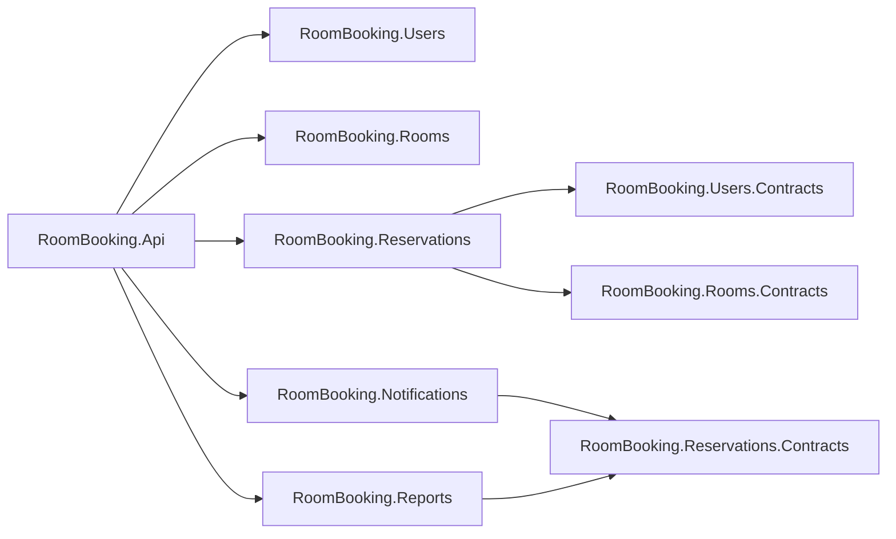

# Module Structure



## Users

```
RoomBooking.Users/
│
├── Features/
│   ├── Login/
│   │   ├── LoginRequest.cs
│   │   ├── LoginEndpoint.cs
│   │   ├── LoginResponse.cs
│   │   ├── LoginCommand.cs
│   │   ├── LoginHandler.cs
│   │   └── LoginValidator.cs
│   │
│   ├── Register/
│   │   ├── RegisterRequest.cs
│   │   ├── RegisterEndpoint.cs
│   │   ├── RegisterCommand.cs
│   │   ├── RegisterHandler.cs
│   │   └── RegisterValidator.cs
│   │
│   └── GetCurrentUser/
│       ├── GetCurrentUserQuery.cs
│       ├── GetCurrentUserHandler.cs
│       └── CurrentUserResponse.cs
│
├── Domain/
│   ├── ApplicationUser.cs
│   └── ApplicationRole.cs
│
├── Jwt/
│   ├── JwtOptions.cs
│   ├── IJwtTokenProvider.cs
│   └── JwtTokenProvider.cs
│
├── Data/
│   ├── Configs/
│   │   ├── ApplicationUserConfig.cs
│   │   └── ApplicationRoleConfig.cs
│   │
│   ├── UsersDbContext.cs
│   └── UsersDbContextFactory.cs
│
└── UsersModuleExtensions.cs
```

## Rooms

```
RoomBooking.Rooms/
│
├── Features/
│   ├── RoomSummaryResponse.cs
│   ├── RoomDetailsResponse.cs
│   ├── CreateRoom/
│   │   ├── CreateRoomRequest.cs
│   │   ├── CreateRoomEndpoint.cs
│   │   ├── CreateRoomCommand.cs
│   │   ├── CreateRoomHandler.cs
│   │   └── CreateRoomValidator.cs
│   │
│   ├── UpdateRoom/
│   │   ├── UpdateRoomRequest.cs
│   │   ├── UpdateRoomEndpoint.cs
│   │   ├── UpdateRoomCommand.cs
│   │   ├── UpdateRoomHandler.cs
│   │   └── UpdateRoomValidator.cs
│   │
│   ├── DeactivateRoom/
│   │   ├── DeactivateRoomEndpoint.cs
│   │   ├── DeactivateRoomCommand.cs
│   │   ├── DeactivateRoomHandler.cs
│   │   └── DeactivateRoomValidator.cs
│   │
│   └── ListRooms/
│       ├── ListRoomsRequest.cs
│       ├── ListRoomsEndpoint.cs
│       ├── ListRoomsQuery.cs
│       ├── ListRoomsHandler.cs
            ListRoomsValidator.cs
│
├── Models/
│   ├── Room.cs
│
├── Data/
│   ├── Configs/
│   │   └── RoomConfig.cs
│   │
│   ├── RoomsDbContext.cs
│   └── RoomsDbContextFactory.cs
│
└── RoomsModuleExtensions.cs
```

## Reservations

```
RoomBooking.Reservations/
    Features/
│   ├── ReservationSummaryResponse.cs
│   ├── ReservationDetailsResponse.cs
        CreateReservation/
│   │   ├── CreateReservationRequest.cs
│           CreateReservationEndpoint.cs
            CreateReservationCommand.cs
            CreateReservationHandler.cs
            CreateReservationValidator.cs
        ConfirmReservation/
│       ├── ConfirmReservationEndpoint.cs
            ConfirmReservationCommand.cs
            ConfirmReservationHandler.cs
            ConfirmReservationValidator.cs
        ListReservations/
│       ├── ListReservationsRequest.cs
│       ├── ListReservationsEndpoint.cs
            ListReservationsQuery.cs
            ListReservationsHandler.cs
            ListReservationsValidator.cs
    Domain/
        ReservationAggregate/
            Reservation.cs
            ReservationStatus.cs
    Data/
        Configs/
            ReservationConfig.cs
        ReservationsDbContext
        ReservationsDbContextFactory
    ReservationsModuleExtensions.cs

RoomBooking.Reservations.Contracts/
    Events/
        ReservationConfirmedEvent.cs
```

## Notifications

```
RoomBooking.Notifications/
    Integrations/
        ReservationConfirmedEventHandler.cs
    NotificationsModuleExtensions.cs
```

## Reports

```
RoomBooking.Reports/
    Features/
        ReservationsByPeriod/
            ReservationsByPeriodRequest.cs
            ReservationsByPeriodEndpoint.cs
            ReservationsByPeriodQuery.cs
            ReservationsByPeriodHandler.cs
            ReservationsByPeriodValidator.cs
            ReservationsByPeriodResponse.cs
        RoomUsageStatistics/
            RoomUsageStatisticsEndpoint.cs
            RoomUsageStatisticsQuery.cs
            RoomUsageStatisticsHandler.cs
            RoomUsageStatisticsValidator.cs
            RoomUsageStatisticsResponse.cs
    Ingest/
        ReservationConfirmedEventHandler.cs
    Models/
        DimDate.cs
        DimRoom.cs
        DimUser.cs
        FactReservation.cs
    Data/
        Configs/
            DimDateConfig.cs
            DimRoomConfig.cs
            DimUserConfig.cs
            FactReservationConfig.cs
        ReportsDbContext
        ReportsDbContextFactory
    ReportsModuleExtensions.cs
```
