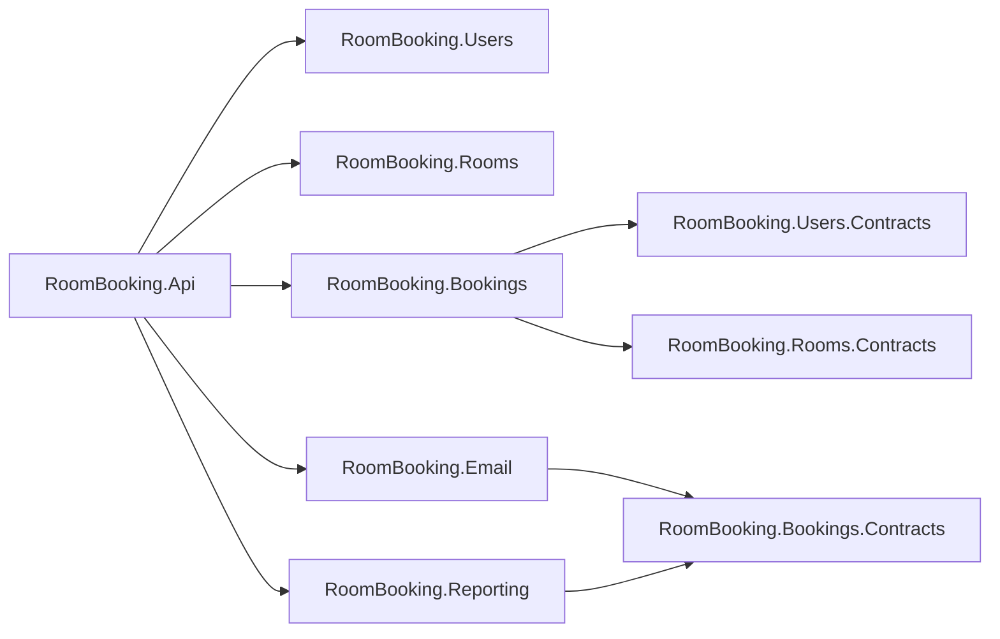

# Module Structure



## Users

```
RoomBooking.Users/
│
├── Features/
│   ├── Login/
│   │   ├── LoginRequest.cs
│   │   ├── LoginEndpoint.cs
│   │   ├── LoginResponse.cs
│   │   ├── LoginCommand.cs
│   │   ├── LoginHandler.cs
│   │   └── LoginValidator.cs
│   │
│   ├── Register/
│   │   ├── RegisterRequest.cs
│   │   ├── RegisterEndpoint.cs
│   │   ├── RegisterCommand.cs
│   │   ├── RegisterHandler.cs
│   │   └── RegisterValidator.cs
│   │
│   └── GetCurrentUser/
│       ├── GetCurrentUserQuery.cs
│       ├── GetCurrentUserHandler.cs
│       └── CurrentUserResponse.cs
│
├── Domain/
│   ├── ApplicationUser.cs
│   └── ApplicationRole.cs
│
├── Jwt/
│   ├── JwtOptions.cs
│   ├── IJwtTokenProvider.cs
│   └── JwtTokenProvider.cs
│
├── Data/
│   ├── Configs/
│   │   ├── ApplicationUserConfig.cs
│   │   └── ApplicationRoleConfig.cs
│   │
│   ├── UsersDbContext.cs
│   └── UsersDbContextFactory.cs
│
└── UsersModuleExtensions.cs
```

## Rooms

```
RoomBooking.Rooms/
│
├── Features/
│   ├── RoomSummaryResponse.cs
│   ├── RoomDetailsResponse.cs
│   ├── CreateRoom/
│   │   ├── CreateRoomRequest.cs
│   │   ├── CreateRoomEndpoint.cs
│   │   ├── CreateRoomCommand.cs
│   │   ├── CreateRoomHandler.cs
│   │   └── CreateRoomValidator.cs
│   │
│   ├── UpdateRoom/
│   │   ├── UpdateRoomRequest.cs
│   │   ├── UpdateRoomEndpoint.cs
│   │   ├── UpdateRoomCommand.cs
│   │   ├── UpdateRoomHandler.cs
│   │   └── UpdateRoomValidator.cs
│   │
│   ├── DeactivateRoom/
│   │   ├── DeactivateRoomEndpoint.cs
│   │   ├── DeactivateRoomCommand.cs
│   │   ├── DeactivateRoomHandler.cs
│   │   └── DeactivateRoomValidator.cs
│   │
│   └── ListRooms/
│       ├── ListRoomsRequest.cs
│       ├── ListRoomsEndpoint.cs
│       ├── ListRoomsQuery.cs
│       ├── ListRoomsHandler.cs
            ListRoomsValidator.cs
│
├── Models/
│   ├── Room.cs
│
├── Data/
│   ├── Configs/
│   │   └── RoomConfig.cs
│   │
│   ├── RoomsDbContext.cs
│   └── RoomsDbContextFactory.cs
│
└── RoomsModuleExtensions.cs
```

## Bookings

```
RoomBooking.Bookings/
    Features/
│   ├── BookingsummaryResponse.cs
│   ├── BookingDetailsResponse.cs
        CreateBooking/
│   │   ├── CreateBookingRequest.cs
│           CreateBookingEndpoint.cs
            CreateBookingCommand.cs
            CreateBookingHandler.cs
            CreateBookingValidator.cs
        ConfirmBooking/
│       ├── ConfirmBookingEndpoint.cs
            ConfirmBookingCommand.cs
            ConfirmBookingHandler.cs
            ConfirmBookingValidator.cs
        ListBookings/
│       ├── ListBookingsRequest.cs
│       ├── ListBookingsEndpoint.cs
            ListBookingsQuery.cs
            ListBookingsHandler.cs
            ListBookingsValidator.cs
    Domain/
        BookingAggregate/
            Booking.cs
            Bookingstatus.cs
    Data/
        Configs/
            BookingConfig.cs
        BookingsDbContext
        BookingsDbContextFactory
    BookingsModuleExtensions.cs

RoomBooking.Bookings.Contracts/
    Events/
        BookingConfirmedEvent.cs
```

## Email

```
RoomBooking.Email/
    Integrations/
        BookingConfirmedEventHandler.cs
    EmailModuleExtensions.cs
```

## Reporting

```
RoomBooking.Reporting/
    Features/
        BookingsByPeriod/
            BookingsByPeriodRequest.cs
            BookingsByPeriodEndpoint.cs
            BookingsByPeriodQuery.cs
            BookingsByPeriodHandler.cs
            BookingsByPeriodValidator.cs
            BookingsByPeriodResponse.cs
        RoomUsageStatistics/
            RoomUsageStatisticsEndpoint.cs
            RoomUsageStatisticsQuery.cs
            RoomUsageStatisticsHandler.cs
            RoomUsageStatisticsValidator.cs
            RoomUsageStatisticsResponse.cs
    Ingest/
        BookingConfirmedEventHandler.cs
    Models/
        DimDate.cs
        DimRoom.cs
        DimUser.cs
        FactBooking.cs
    Data/
        Configs/
            DimDateConfig.cs
            DimRoomConfig.cs
            DimUserConfig.cs
            FactBookingConfig.cs
        ReportingDbContext
        ReportingDbContextFactory
    ReportingModuleExtensions.cs
```
