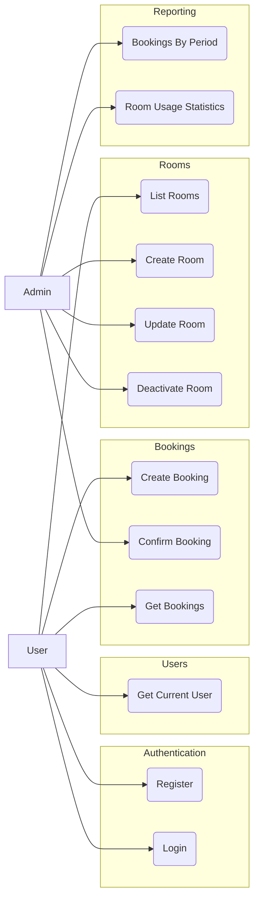

# Use Cases

```mermaid
flowchart LR

    User[User]
    Admin[Admin]

    subgraph Authentication
        UC1(Register)
        UC2(Login)
    end

    subgraph Users
        UC3(Get Current User)
    end

    subgraph Rooms
        UC4(List Rooms)
        UC5(Create Room)
        UC6(Update Room)
        UC7(Deactivate Room)
    end

    subgraph Bookings
        UC8(Create Booking)
        UC9(Confirm Booking)
        UC10(Get Bookings)
    end

    subgraph Reporting
        UC11(Bookings By Period)
        UC12(Room Usage Statistics)
    end

    User --> UC1
    User --> UC2

    User --> UC3

    User --> UC4
    User --> UC8
    User --> UC10

    Admin --> UC5
    Admin --> UC6
    Admin --> UC7

    Admin --> UC9

    Admin --> UC11
    Admin --> UC12
```
